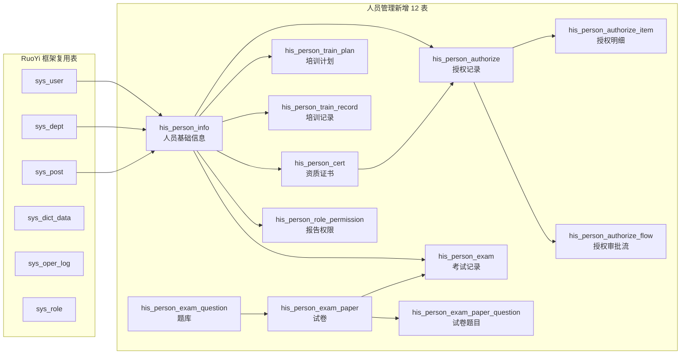
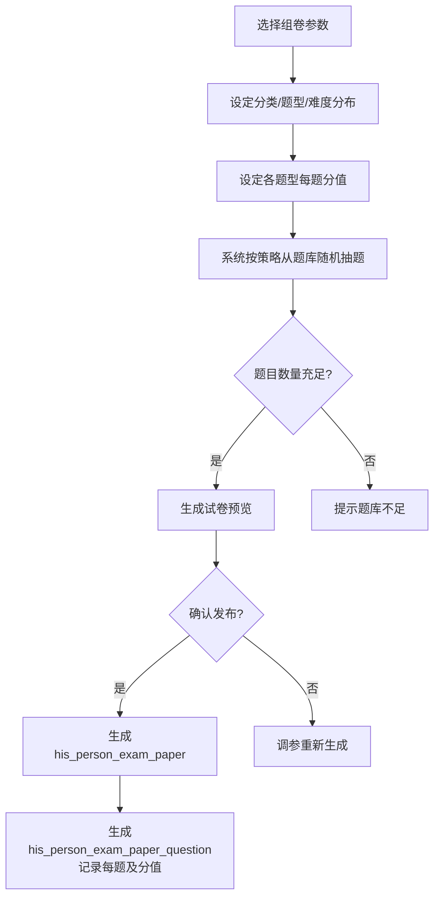
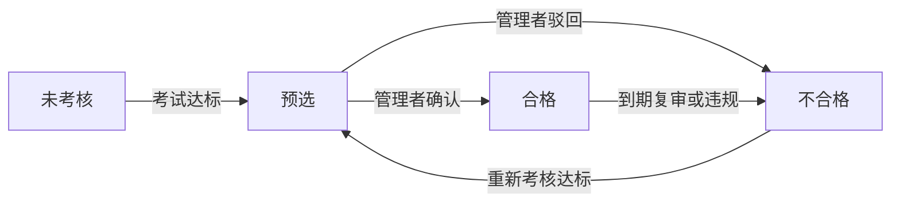
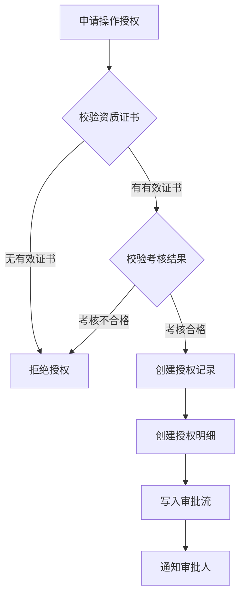
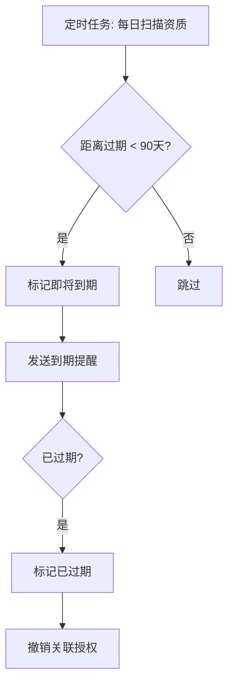
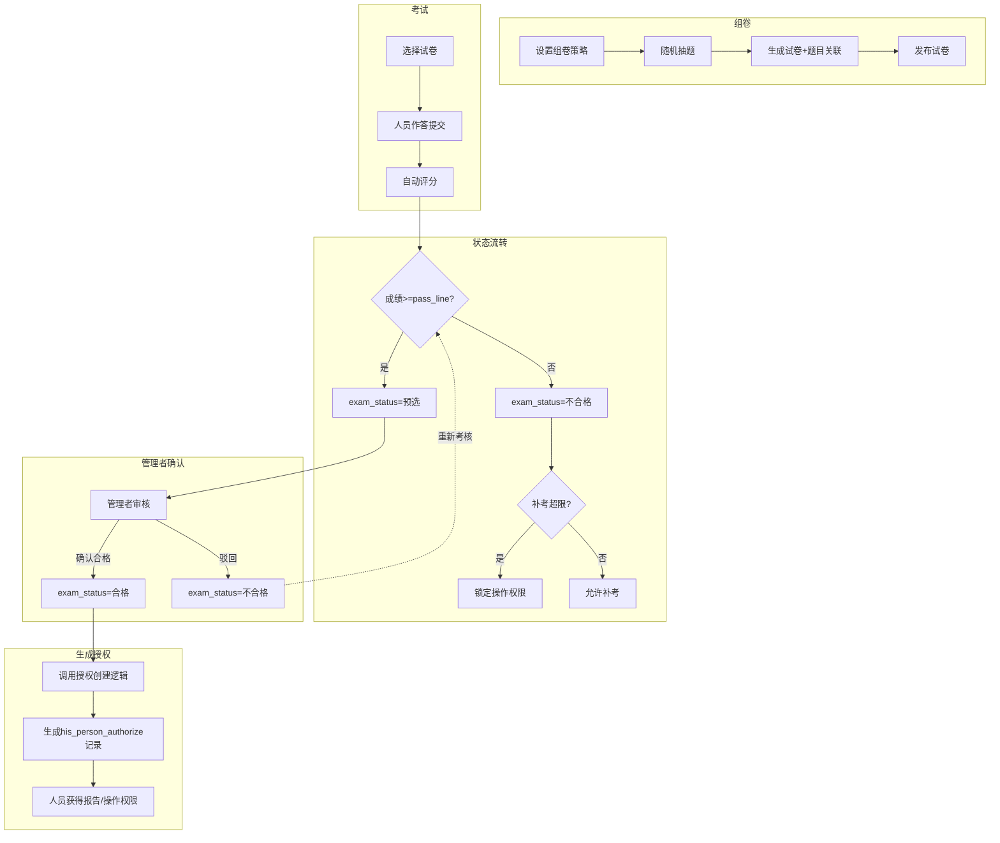

# 设计文档

**状态**: 已批准
**版本**: 1.2.0
**最后更新**: 2026-05-04
**关联需求**: FR-001,FR-021
**最后更新**: 2026-05-04

## 1. 修订历史

| 版本 | 日期 | 作者 | 变更说明 |
|------|------|------|----------|
| 1.0.0 | 2026-05-04 | 马海军 | 初稿 |
| 1.1.0 | 2026-05-04 | 马海军 | 补充试卷、试卷题目关联表，完善考核管理数据模型 |
| 1.2.0 | 2026-05-04 | 马海军 | 引入考核预选机制：考核合格→预选→管理者确认→正式授权 |
| 1.3.0 | 2026-05-07 | Sisyphus | 完善前后端交互流程，对齐已实现的12模块CRUD，补充Vue视图、API调用、前后端数据流 |

## 2. 执行摘要

本文档描述 POCT 人员管理模块的设计方案，覆盖人员基础信息、资质、授权、档案查询、培训、考核及报告权限七个子模块。设计基于 RuoYi-Cloud-Plus 框架，复用 `sys_user`、`sys_dept`、`sys_post`、`sys_dict_data`、`sys_oper_log` 等现有表结构，新增 12 张业务表实现人员全生命周期管理。

## 3. 系统架构

### 3.1 架构风格

* 项目后台为 Spring Cloud 微服务，前端为 Vue 微前端架构
* 子应用后台模块在 `poct-lis/his-modules/his-module-person` 目录中
* 微前端模块在 `poct-ui-person` 目录中，把 `poct-ui-lis` 中的程序拷贝过来作为基础模块

### 3.2 系统上下文 (C4 L1)

* 微服务管理与核心模块由其他团队处理，当前项目不处理
* 微前端主应用模块由其他团队处理，当前项目只负责业务功能
* 参考 `his-module-lis` 模块的 CRUD 模式完成新模块功能

### 3.3 模块依赖关系



## 4. 技术栈与规约

### 4.1 技术选型

| 层级 | 技术 | 说明 |
|------|------|------|
| 语言 | Java 17 | |
| 框架 | Spring Boot 3.x + Spring Cloud | RuoYi-Cloud-Plus |
| ORM | MyBatis-Plus 3.5 | |
| 对象映射 | MapStruct Plus (`@AutoMapper`) | |
| 数据库 | MySQL (ry-cloud 库) | 动态数据源 `@DS("his-lis")` |
| 校验 | Jakarta Validation | `@NotNull(AddGroup.class)` |
| 权限 | Spring Security + RuoYi 权限体系 | |
| 缓存 | Redis（若依自带） | |
| 操作日志 | `sys_oper_log` | 复用 RuoYi 操作日志 |

### 4.2 代码结构规约（参考 his-module-lis 模式）

```
his-common/
  his-common-person/
    src/main/java/org/rolkey/his/person/
      domain/
        Person*.java                    # Entity @TableName("his_*")
        bo/Person*Bo.java               # @AutoMapper(target = Entity.class)
        vo/Person*Vo.java               # @AutoMapper(target = Entity.class), @ExcelProperty
      mapper/Person*Mapper.java         # @DS("his-lis"), BaseMapperPlus<Entity, Vo>
      service/
        IPerson*Service.java            # 接口
        impl/Person*ServiceImpl.java    # @Service, buildQueryWrapper()
his-modules/
  his-module-person/
    src/main/java/org/rolkey/his/person/
      controller/Person*Controller.java # @RestController, CRUD 6方法
      HisPersonApplication.java         # Spring Boot 入口
```

## 5. 数据模型

### 5.0 数据库连接

```yaml
数据库连接参数1：
  url: jdbc:mysql://192.168.168.128:3306/ry-cloud
  user: ruoyi
  password: Ruoyi@111

数据库连接参数2：
  url: jdbc:postgresql://192.168.168.128:5432/postgres
  user: postgres
  password: root
  driver-class-name: org.postgresql.Driver
```

### 5.1 实体关系 (ER)

```mermaid
erDiagram
    %% ============ 复用表 ============
    sys_user {
        bigint user_id PK
        bigint dept_id FK "所属部门"
        varchar user_name "登录名"
        varchar nick_name "显示名称"
        varchar email
        varchar phonenumber
        char sex "0-未知 1-男 2-女"
        char status "0-正常 1-停用"
    }

    sys_dept {
        bigint dept_id PK
        bigint parent_id
        varchar dept_name "科室名称"
        varchar dept_category "科室分类"
        int order_num
    }

    sys_post {
        bigint post_id PK
        bigint dept_id FK
        varchar post_code
        varchar post_name "岗位名称"
        varchar post_category "岗位分类"
    }

    sys_dict_data {
        bigint dict_code PK
        varchar dict_label "字典标签"
        varchar dict_value "字典值"
        varchar dict_type "字典类型编码"
    }

    sys_oper_log {
        bigint oper_id PK
        varchar title "模块标题"
        int business_type "业务类型"
        varchar oper_name "操作人员"
        varchar oper_param "请求参数"
        int status "0-正常 1-异常"
    }

    %% ============ 新增表 ============
    his_person_info {
        bigint person_id PK "人员ID"
        varchar emp_no UK "工号(唯一标识)"
        varchar person_name "姓名"
        char gender "性别 M/F"
        date birth_date "出生日期"
        bigint dept_id FK "所在部门/科室"
        bigint post_id FK "岗位/职称"
        varchar education "最高学历"
        varchar major "专业"
        varchar phone "联系电话"
        varchar email "邮箱"
        date hire_date "入职日期"
        varchar person_status "状态: 在岗/离职/调岗"
    }

    his_person_cert {
        bigint cert_id PK "证书ID"
        bigint person_id FK "人员ID"
        varchar cert_type "证书类型: dict"
        varchar cert_name "证书名称"
        varchar cert_no "证书编号"
        varchar issuer "发证机构"
        date issue_date "发证日期"
        date expire_date "有效期至"
        varchar cert_file "附件路径(图片/PDF)"
        varchar cert_status "有效/即将到期/已过期"
    }

    his_person_authorize {
        bigint auth_id PK "授权ID"
        bigint person_id FK "人员ID"
        varchar auth_type "授权类型: 操作/报告/质控/管理"
        date start_date "授权开始"
        date end_date "授权结束"
        varchar auth_status "有效/已过期/已撤销"
        bigint approve_by "审批人"
        date approve_time "审批时间"
        varchar remark "备注"
    }

    his_person_authorize_item {
        bigint item_id PK "明细ID"
        bigint auth_id FK "授权ID"
        varchar target_type "目标类型: 设备/项目"
        varchar target_id "目标ID(仪器ID或项目ID)"
    }

    his_person_authorize_flow {
        bigint flow_id PK "流程ID"
        bigint person_id FK "申请人"
        varchar flow_type "申请类型"
        varchar flow_status "待审核/已通过/已驳回"
        bigint auditor1 "科室主管"
        bigint auditor2 "检验科/质管部门"
        date create_time "申请时间"
        date finish_time "完成时间"
    }

    his_person_train_plan {
        bigint plan_id PK "计划ID"
        varchar plan_name "计划名称"
        varchar plan_type "年度/季度"
        int year "年度"
        int quarter "季度"
        varchar course_content "课程内容"
        date start_date "开始日期"
        date end_date "结束日期"
        varchar status "状态"
    }

    his_person_train_record {
        bigint record_id PK "记录ID"
        bigint person_id FK "人员ID"
        bigint plan_id FK "计划ID"
        decimal hours "培训时长"
        decimal progress "学习进度(%)"
        datetime sign_in_time "签到时间"
        varchar cert_generated "是否生成证书 Y/N"
        date cert_expire_date "证书有效期"
    }

    his_person_exam {
        bigint exam_id PK "考试记录ID"
        bigint person_id FK "人员ID"
        bigint paper_id FK "关联试卷"
        varchar exam_type "在线考试/操作考核"
        varchar exam_name "考试名称"
        decimal score "总分"
        varchar result "合格/不合格"
        decimal pass_line "合格分数线"
        int total_questions "总题数"
        int correct_count "正确数"
        text answer_sheet "答题详情(JSON)"
        int retry_count "补考次数"
        date exam_date "考试日期"
        varchar auto_authorize "自动授权 Y/N"
    }

    his_person_exam_question {
        bigint question_id PK "题目ID"
        varchar question_type "单选/多选/判断/操作"
        varchar content "题目内容"
        varchar options "选项(JSON)"
        varchar answer "正确答案"
        int difficulty "难度系数 1-5"
        varchar category "题目分类"
        varchar status "启用/停用"
    }

    his_person_exam_paper {
        bigint paper_id PK "试卷ID"
        varchar paper_name "试卷名称"
        decimal total_score "试卷总分"
        decimal pass_line "合格分数线"
        int question_count "题目总数"
        varchar strategy "组卷策略(JSON)"
        varchar status "未发布/已发布/已作废"
        date publish_date "发布日期"
    }

    his_person_exam_paper_question {
        bigint id PK "关联ID"
        bigint paper_id FK "试卷ID"
        bigint question_id FK "题目ID"
        int sort_no "排序号"
        decimal score "本题分值"
    }

    his_person_role_permission {
        bigint perm_id PK "权限ID"
        bigint role_id FK "角色ID(sys_role)"
        varchar oper_perm "操作权限: 设备操作/报告录入/报告审核/报告发布"
        varchar data_scope "数据权限: 本科室/全院"
        date start_date "生效日期"
        date end_date "失效日期"
        varchar perm_status "有效/已失效"
    }

    %% ============ 关系 ============
    sys_user ||--o{ his_person_info : "扩展"
    sys_dept ||--o{ his_person_info : "所属部门"
    sys_post ||--o{ his_person_info : "岗位/职称"
    his_person_info ||--o{ his_person_cert : "持有"
    his_person_info ||--o{ his_person_authorize : "授权"
    his_person_authorize ||--o{ his_person_authorize_item : "包含"
    his_person_info ||--o{ his_person_authorize_flow : "申请"
    his_person_info ||--o{ his_person_train_plan : "参与"
    his_person_info ||--o{ his_person_train_record : "记录"
    his_person_info ||--o{ his_person_exam : "考试"
    his_person_exam_paper ||--o{ his_person_exam : "被考试"
    his_person_exam_paper ||--o{ his_person_exam_paper_question : "包含题目"
    his_person_exam_question ||--o{ his_person_exam_paper_question : "被选入"
    his_person_exam_question ||--o{ his_person_exam_paper : "组卷来源"
    sys_role ||--o{ his_person_role_permission : "关联"
```



### 5.2 核心数据模型详解

#### 5.2.1 复用 RuoYi 框架表

| 表名 | 用途 | 复用方式 |
|------|------|----------|
| `sys_user` | 用户登录、基础账号信息 | 与 `his_person_info` 一对一关联扩展 |
| `sys_dept` | 科室/部门树形结构 | 直接作为人员所属部门 |
| `sys_post` | 岗位/职称字典 | `post_category` 区分职称级别 |
| `sys_dict_data` | 性别、学历、证书类型等枚举 | 统一管理字典数据 |
| `sys_oper_log` | 所有业务操作日志 | 自动记录字段变更 |
| `sys_role` | 角色定义 | 关联 `his_person_role_permission` |

#### 5.2.2 his_person_info — 人员基础信息表

核心人员档案，与 `sys_user` 一对一扩展，`sys_user` 存登录态，`his_person_info` 存业务属性。

| 字段 | 类型 | 约束 | 说明 |
|------|------|------|------|
| person_id | bigint | PK | 人员ID |
| emp_no | varchar(50) | UK, NOT NULL | 工号（唯一标识） |
| person_name | varchar(50) | NOT NULL | 姓名 |
| gender | char(1) | | M/F，字典：sys_sex |
| birth_date | date | | 出生日期 |
| dept_id | bigint | FK -> sys_dept | 所在部门/科室 |
| post_id | bigint | FK -> sys_post | 职务/职称 |
| education | varchar(50) | | 最高学历，字典 |
| major | varchar(100) | | 专业 |
| phone | varchar(20) | | 联系电话 |
| email | varchar(100) | | 邮箱 |
| hire_date | date | | 入职日期 |
| person_status | varchar(20) | | 在岗/离职/调岗，字典 |
| exam_status | varchar(20) | | **考核状态：未考核/预选/合格/不合格**，见下方说明 |
| user_id | bigint | FK -> sys_user | 关联系统用户ID（可选） |

**功能映射**：
- 新增/编辑 → `insert`/`update`
- 禁用/启用 → `person_status` 字段
- 批量导入导出 → `@ExcelProperty` 注解 + EasyExcel
- 字段变更日志 → `sys_oper_log` 记录

**字典表（sys_dict_data）规划**：

| dict_type | 值 |
|-----------|-----|
| sys_sex | 0=未知, 1=男, 2=女 |
| his_person_education | 博士/硕士/本科/大专/其他 |
| his_person_status | 在岗/离职/调岗 |
| his_person_exam_status | 未考核/预选/合格/不合格 |

> **预选**：人员考试达到标准但尚未经管理者最终确认，暂不具备报告操作权限。

#### 5.2.3 his_person_cert — 资质证书表

| 字段 | 类型 | 约束 | 说明 |
|------|------|------|------|
| cert_id | bigint | PK | 证书ID |
| person_id | bigint | FK, NOT NULL | 人员ID |
| cert_type | varchar(50) | NOT NULL | 证书类型：执业医师/护士/技术资格/POCT专项/仪器认证 |
| cert_name | varchar(200) | | 证书名称 |
| cert_no | varchar(100) | | 编号（执业证书编号等） |
| issuer | varchar(200) | | 发证机构 |
| issue_date | date | | 发证日期 |
| expire_date | date | | 有效期至 |
| cert_file | varchar(500) | | 附件 OSS 路径（图片/PDF） |
| cert_status | varchar(20) | | 有效/即将到期/已过期（自动计算） |

**通知提醒机制**：
- 定时任务每日扫描 `expire_date`，提前 90 天标记为"即将到期"
- 到期自动标记为"已过期"，`cert_status` 变更触发 `sys_oper_log`

**字典（cert_type）**：
```
his_person_cert_type:
  执业医师证书 / 护士执业证书 / 医学检验技术资格 / POCT专项培训合格证书 / 仪器操作认证
```

#### 5.2.4 his_person_authorize — 授权记录表

| 字段 | 类型 | 约束 | 说明 |
|------|------|------|------|
| auth_id | bigint | PK | 授权ID |
| person_id | bigint | FK, NOT NULL | 人员ID |
| auth_type | varchar(50) | NOT NULL | 操作授权/报告权限/质控权限/管理权限 |
| start_date | date | | 授权开始日期 |
| end_date | date | | 授权结束日期（自动到期停权） |
| auth_status | varchar(20) | | 有效/已过期/已撤销 |
| approve_by | bigint | | 审批人 |
| approve_time | datetime | | 审批时间 |
| remark | varchar(500) | | 备注（临时授权说明等） |

**his_person_authorize_item — 授权明细表**

| 字段 | 类型 | 约束 | 说明 |
|------|------|------|------|
| item_id | bigint | PK | 明细ID |
| auth_id | bigint | FK, NOT NULL | 授权ID |
| target_type | varchar(20) | | 目标类型：设备/项目 |
| target_id | varchar(50) | | 目标ID（`instrument_id` 或 `test_item_id`） |

**his_person_authorize_flow — 授权审批流**

| 字段 | 类型 | 约束 | 说明 |
|------|------|------|------|
| flow_id | bigint | PK | 流程ID |
| person_id | bigint | FK | 申请人 |
| flow_type | varchar(50) | | 授权申请类型 |
| flow_status | varchar(20) | | 待审核/已通过/已驳回 |
| auditor1 | bigint | | 科室主管（第一级审核） |
| auditor1_time | datetime | | 科室主管审核时间 |
| auditor2 | bigint | | 检验科/质管部门（第二级审核） |
| auditor2_time | datetime | | 质检部门审核时间 |
| create_time | datetime | | 申请时间 |
| finish_time | datetime | | 完成时间 |

**授权管理逻辑**：
1. 新建授权时必须校验 `his_person_cert` 中是否存在满足条件的有效资质
2. `his_person_exam` 中考核结果须为"合格"
3. 授权到期前 30 天系统通知提醒（消息/邮件）
4. 到期时自动将 `auth_status` 更新为"已过期"
5. 过期的资质自动撤销关联授权

#### 5.2.5 his_person_train_plan — 培训计划

| 字段 | 类型 | 约束 | 说明 |
|------|------|------|------|
| plan_id | bigint | PK | 计划ID |
| plan_name | varchar(200) | NOT NULL | 计划名称 |
| plan_type | varchar(20) | | 年度/季度 |
| year | int | | 年度 |
| quarter | int | | 季度 |
| course_content | text | | 课程内容 |
| start_date | date | | 开始日期 |
| end_date | date | | 结束日期 |
| status | varchar(20) | | 未开始/进行中/已结束 |

#### 5.2.6 his_person_train_record — 培训记录

| 字段 | 类型 | 约束 | 说明 |
|------|------|------|------|
| record_id | bigint | PK | 记录ID |
| person_id | bigint | FK, NOT NULL | 人员ID |
| plan_id | bigint | FK | 培训计划ID |
| hours | decimal(5,1) | | 培训时长（小时） |
| progress | decimal(5,2) | | 学习进度（%） |
| sign_in_time | datetime | | 签到时间 |
| cert_generated | char(1) | | 是否已生成合格证书 Y/N |
| cert_expire_date | date | | 证书有效期 |

#### 5.2.7 his_person_exam_question — 题库

题目的原始存储，是组卷的基础数据源。

| 字段 | 类型 | 约束 | 说明 |
|------|------|------|------|
| question_id | bigint | PK | 题目ID |
| question_type | varchar(20) | NOT NULL | 单选/多选/判断/操作 |
| content | text | NOT NULL | 题目内容 |
| options | text | | 选项（JSON 格式） |
| answer | text | | 正确答案 |
| difficulty | int | | 难度系数 1-5（数值越大越难） |
| category | varchar(100) | | 题目分类（如"生化""血气""血糖"） |
| status | char(1) | | 启用/停用 |

**字典（question_type）**：
```
his_person_question_type:
  单选题 / 多选题 / 判断题 / 操作题
```

#### 5.2.8 his_person_exam_paper — 试卷

从题库按策略自动生成的试卷实体，支持多次考试引用同一份试卷。

| 字段 | 类型 | 约束 | 说明 |
|------|------|------|------|
| paper_id | bigint | PK | 试卷ID |
| paper_name | varchar(200) | NOT NULL | 试卷名称 |
| total_score | decimal(5,2) | NOT NULL | 试卷总分（各题分值之和） |
| pass_line | decimal(5,2) | NOT NULL | 合格分数线 |
| question_count | int | | 题目总数 |
| duration_minutes | int | | 考试时长（分钟） |
| strategy | text | | 组卷策略（JSON，记录组卷时的参数快照） |
| status | varchar(20) | | 未发布/已发布/已作废 |
| generate_type | varchar(20) | | 自动组卷/手动组卷 |
| publish_date | datetime | | 发布日期 |
| create_by | bigint | | 组卷人 |

**组卷策略（strategy JSON 示例）**：
```json
{
  "categories": ["生化", "血气"],
  "difficultyDistribution": [
    {"level": 1, "count": 5},
    {"level": 2, "count": 10},
    {"level": 3, "count": 5}
  ],
  "typeDistribution": [
    {"type": "单选题", "count": 15, "scorePerQuestion": 4},
    {"type": "多选题", "count": 5, "scorePerQuestion": 6},
    {"type": "判断题", "count": 5, "scorePerQuestion": 2}
  ],
  "shuffle": true,
  "generatedAt": "2026-05-04 10:00:00"
}
```

**组卷流程**：



#### 5.2.9 his_person_exam_paper_question — 试卷题目关联

试卷和题目的多对多关联表，记录每道题在试卷中的排序和分值。

| 字段 | 类型 | 约束 | 说明 |
|------|------|------|------|
| id | bigint | PK | 关联ID |
| paper_id | bigint | FK, NOT NULL | 试卷ID |
| question_id | bigint | FK, NOT NULL | 题目ID |
| sort_no | int | | 排序号（题号） |
| score | decimal(5,2) | NOT NULL | 本题分值 |

> 试卷题目一旦生成，即固定不变。即使后续题库中题目被修改或停用，已生成的试卷**不受影响**（保留组卷时的题目快照）。

#### 5.2.10 his_person_exam — 考试记录

记录每次考试的答题情况，关联到具体试卷。支持同一份试卷被多人多次考试。

| 字段 | 类型 | 约束 | 说明 |
|------|------|------|------|
| exam_id | bigint | PK | 考试记录ID |
| person_id | bigint | FK, NOT NULL | 人员ID |
| paper_id | bigint | FK | 关联试卷ID（为空则操作考核不入卷） |
| exam_type | varchar(20) | | 在线考试/操作考核 |
| exam_name | varchar(200) | | 考试名称（可自动从试卷名称带出） |
| score | decimal(5,2) | | 总分 |
| pass_line | decimal(5,2) | | 合格分数线（从试卷冗余存储，避免联表） |
| result | varchar(10) | | 合格/不合格 |
| total_questions | int | | 总题数 |
| correct_count | int | | 正确题数 |
| answer_sheet | text | | 答题详情（JSON，记录每题的作答和评分） |
| duration_seconds | int | | 答题用时（秒） |
| retry_count | int | | 补考次数（第几次考试） |
| exam_date | datetime | | 考试时间 |
| auto_authorize | char(1) | | 合格自动授权 Y/N |

**answer_sheet JSON 示例**：
```json
[
  {"questionId": 101, "sortNo": 1, "userAnswer": "A", "correctAnswer": "A", "isCorrect": true, "score": 4},
  {"questionId": 102, "sortNo": 2, "userAnswer": "B", "correctAnswer": "C", "isCorrect": false, "score": 0}
]
```

**考核状态流转**：



| 原状态 | 事件 | 新状态 | 说明 |
|--------|------|--------|------|
| 未考核 | 考试达标（score >= pass_line） | **预选** | 系统自动设预选，等待管理者确认 |
| 未考核 | 考试未达标（score < pass_line） | 不合格 | |
| 预选 | 管理者点击"确认合格" | **合格** | 此时才生成授权记录 |
| 预选 | 管理者点击"驳回" | 不合格 | |
| 合格 | 到期复审未通过 / 违规 | 不合格 | |
| 不合格 | 补考达标 | 预选 | |

> `auto_authorize` 字段取消，由 `his_person_info.exam_status` 统一管理状态流转。
> **合格→生成授权**：仅当 `exam_status = 合格` 且管理者触发"确认合格"操作时，才调用授权创建逻辑。

#### 5.2.11 his_person_role_permission — 报告权限管理

| 字段 | 类型 | 约束 | 说明 |
|------|------|------|------|
| perm_id | bigint | PK | 权限ID |
| role_id | bigint | FK -> sys_role | 角色ID |
| person_id | bigint | FK | 人员ID（按人授权时使用） |
| oper_perm | varchar(200) | | 操作权限集合，多选逗号分隔 |
| data_scope | varchar(20) | | 数据权限：本科室/全院 |
| start_date | date | | 生效日期 |
| end_date | date | | 失效日期 |
| perm_status | varchar(20) | | 有效/已失效 |

**oper_perm 可选值**（系统参数配置）：
- 设备操作
- 报告录入
- 报告审核
- 报告发布

**权限控制矩阵**：

| 角色 | 设备操作 | 报告录入 | 报告审核 | 报告发布 | 数据范围 |
|------|---------|---------|---------|---------|---------|
| 操作员 | ✅ | ✅ | | | 本科室 |
| 审核员 | | | ✅ | | 本科室 |
| 管理员 | ✅ | ✅ | ✅ | ✅ | 全院 |
| 质控员 | | | | | 质控数据 |

## 6. 接口设计

### 6.1 基础信息管理 API

| 方法 | 路径 | 说明 |
|------|------|------|
| GET | `/person/info/list` | 分页查询人员列表 |
| GET | `/person/info/{personId}` | 查询人员详情 |
| POST | `/person/info` | 新增人员 |
| PUT | `/person/info` | 编辑人员 |
| PUT | `/person/info/{personId}/status` | 禁用/启用人员 |
| DELETE | `/person/info/{ids}` | 删除人员 |
| POST | `/person/info/import` | 批量导入（Excel） |
| GET | `/person/info/export` | 导出（Excel） |

### 6.2 资质管理 API

| 方法 | 路径 | 说明 |
|------|------|------|
| GET | `/person/cert/list` | 分页查询证书 |
| GET | `/person/cert/{certId}` | 证书详情 |
| POST | `/person/cert` | 新增证书 |
| PUT | `/person/cert` | 编辑证书 |
| DELETE | `/person/cert/{ids}` | 删除证书 |
| POST | `/person/cert/upload` | 上传证书附件 |
| GET | `/person/cert/expiring` | 即将到期证书列表 |

### 6.3 授权管理 API

| 方法 | 路径 | 说明 |
|------|------|------|
| GET | `/person/authorize/list` | 分页查询授权 |
| POST | `/person/authorize` | 新增授权 |
| PUT | `/person/authorize` | 编辑授权 |
| DELETE | `/person/authorize/{ids}` | 撤销授权 |
| POST | `/person/authorize/flow` | 提交授权申请 |
| PUT | `/person/authorize/flow/{flowId}/approve` | 审核授权申请 |

### 6.4 人员考核状态管理

| 方法 | 路径 | 说明 |
|------|------|------|
| GET | `/person/info/preselection/list` | 预选人员列表（exam_status=预选） |
| PUT | `/person/info/preselection/confirm` | 批量确认预选→合格（生成授权） |
| PUT | `/person/info/preselection/reject` | 批量驳回预选→不合格 |

### 6.5 档案查询 API

| 方法 | 路径 | 说明 |
|------|------|------|
| GET | `/person/profile/list` | 组合查询档案 |
| GET | `/person/profile/{personId}` | 详细档案页 |
| GET | `/person/profile/export` | 导出查询结果（Excel/CSV） |
| POST | `/person/profile/print` | 批量打印 |

### 6.6 培训管理 API

| 方法 | 路径 | 说明 |
|------|------|------|
| GET | `/person/train/plan/list` | 培训计划列表 |
| POST | `/person/train/plan` | 新增培训计划 |
| PUT | `/person/train/plan` | 编辑培训计划 |
| GET | `/person/train/record/list` | 培训记录列表 |
| POST | `/person/train/record` | 记录培训签到 |

### 6.7 考核管理 API

#### 题库

| 方法 | 路径 | 说明 |
|------|------|------|
| GET | `/person/exam/question/list` | 分页查询题库 |
| GET | `/person/exam/question/{questionId}` | 题目详情 |
| POST | `/person/exam/question` | 新增题目 |
| PUT | `/person/exam/question` | 编辑题目 |
| DELETE | `/person/exam/question/{ids}` | 删除题目（已组卷题目仅标记停用） |
| POST | `/person/exam/question/import` | 批量导入题目（Excel） |
| GET | `/person/exam/question/export` | 导出题目 |

#### 试卷

| 方法 | 路径 | 说明 |
|------|------|------|
| GET | `/person/exam/paper/list` | 分页查询试卷列表 |
| GET | `/person/exam/paper/{paperId}` | 试卷详情（含题目明细） |
| POST | `/person/exam/paper/generate` | 按策略自动组卷 |
| POST | `/person/exam/paper` | 手动创建试卷 |
| PUT | `/person/exam/paper` | 编辑试卷（仅未发布状态可编辑） |
| PUT | `/person/exam/paper/{paperId}/publish` | 发布试卷 |
| DELETE | `/person/exam/paper/{ids}` | 删除试卷 |

#### 考试记录

| 方法 | 路径 | 说明 |
|------|------|------|
| GET | `/person/exam/list` | 分页查询考试记录 |
| GET | `/person/exam/{examId}` | 考试详情（含答卷明细） |
| POST | `/person/exam` | 提交答题/录入考核成绩 |
| GET | `/person/exam/statistics` | 考核统计（合格率、平均分等） |

### 6.8 报告权限 API

| 方法 | 路径 | 说明 |
|------|------|------|
| GET | `/person/permission/list` | 分页查询权限配置 |
| POST | `/person/permission` | 新增权限配置 |
| PUT | `/person/permission` | 编辑权限配置 |
| DELETE | `/person/permission/{ids}` | 删除权限配置 |

## 7. 前后端交互详解

### 7.1 通用CRUD交互流程

所有12个模块遵循**完全一致的**前后端交互模式，以下以「人员基础信息」为例详述。

#### 7.1.1 查询列表（Query List）

```
┌──────────────────────────────────────────────────────┐
│ 前端 Vue (personInfo/index.vue)                     │
│  1. onMounted() → 调用 getList()                         │
│  2. getList() 设置 loading=true                          │
│  3. 调用 API: listPersonInfo(queryParams.value)       │
└────────────────┬──────────────────────────────────────┘
                 │ axios request
┌────────────────▼──────────────────────────────────────┐
│ 前端 API (api/lis/person/personInfo/index.ts)         │
│  4. return request({                                    │
│       url: `/${hisPerson()}/personInfo/list`,         │
│       method: "get",                                 │
│       params: query                                  │
│     })                                                  │
└────────────────┬──────────────────────────────────────┘
                 │ HTTP GET
┌────────────────▼──────────────────────────────────────┐
│ 后端 Controller (PersonInfoController.java)                │
│  5. @GetMapping("/list")                             │
│     public TableDataInfo<PersonInfoVo> list(              │
│         PersonInfoBo bo, PageQuery pageQuery) {          │
│  6. return personInfoService.queryPageList(bo, pageQuery) │
│     }                                                  │
└────────────────┬──────────────────────────────────────┘
                 │
┌────────────────▼──────────────────────────────────────┐
│ 后端 Service (PersonInfoServiceImpl.java)                 │
│  7. public TableDataInfo<PersonInfoVo> queryPageList(  │
│         PersonInfoBo bo, PageQuery pageQuery) {          │
│  8. LambdaQueryWrapper<PersonInfo> lqw =            │
│         buildQueryWrapper(bo);                        │
│  9. Page<PersonInfoVo> result =                  │
│         baseMapper.selectVoPage(                       │
│             pageQuery.build(), lqw);                   │
│  10. return TableDataInfo.build(result);               │
│     }                                                  │
└────────────────┬──────────────────────────────────────┘
                 │ MyBatis-Plus
┌────────────────▼──────────────────────────────────────┐
│ 数据库 (his_person_info 表)                          │
│  11. SELECT * FROM his_person_info                  │
│      WHERE ... ORDER BY ... LIMIT ?,?               │
│  12. 返回 PersonInfoVo 列表 + total                  │
└────────────────┬──────────────────────────────────────┘
                 │ JSON response
┌────────────────▼──────────────────────────────────────┐
│ 前端 Vue                                          │
│  13. personInfoList.value = res.rows                    │
│  14. total.value = res.total                          │
│  15. loading=false，表格渲染                          │
└──────────────────────────────────────────────────────┘
```

**搜索字段**：工号(empNo)、姓名(personName)、出生日期范围(birthDate)、科室(deptId)、职称(postId)、学历(education)、专业(major)、电话(phone)

#### 7.1.2 新增记录（Add）

```
┌──────────────────────────────────────────────────────┐
│ 前端 Vue                                           │
│  1. 点击「新增」按钮 → handleAdd()                         │
│  2. reset() 重置表单，dialog.visible=true                    │
│  3. dialog标题设为「添加人员基础信息」                      │
│  4. 用户填写表单（工号*、姓名*、性别、出生日期等）    │
│  5. 点击「确定」 → submitForm()                          │
│  6. personInfoFormRef.validate() 校验通过                   │
│  7. 调用 API: addPersonInfo(form.value)               │
└────────────────┬──────────────────────────────────────┘
                 │
┌────────────────▼──────────────────────────────────────┐
│ 前端 API                                           │
│  8. return request({                                    │
│       url: `/${hisPerson()}/personInfo`,               │
│       method: "post",                                │
│       data: form                                    │
│     })                                                  │
└────────────────┬──────────────────────────────────────┘
                 │ HTTP POST
┌────────────────▼──────────────────────────────────────┐
│ 后端 Controller                                    │
│  9. @PostMapping("")                                │
│     public R<Void> add(@Validated(AddGroup) @RequestBody  │
│                           PersonInfoBo bo) {           │
│  10. return toAjax(personInfoService.insertByBo(bo))     │
│     }                                                  │
└────────────────┬──────────────────────────────────────┘
                 │
┌────────────────▼──────────────────────────────────────┐
│ 后端 Service                                      │
│  11. public Boolean insertByBo(PersonInfoBo bo) {         │
│  12. PersonInfo add = MapstructUtils.convert(         │
│             bo, PersonInfo.class);                     │
│  13. validEntityBeforeSave(add);                      │
│  14. boolean flag = baseMapper.insert(add) > 0;          │
│  15. if (flag) bo.setPersonId(add.getPersonId());    │
│  16. return flag;                                      │
│     }                                                  │
└────────────────┬──────────────────────────────────────┘
                 │ MyBatis-Plus
┌────────────────▼──────────────────────────────────────┐
│ 数据库                                            │
│  17. INSERT INTO his_person_info VALUES (...)            │
│  18. 生成 person_id（雪花算法）                          │
└────────────────┬──────────────────────────────────────┘
                 │ 响应
┌────────────────▼──────────────────────────────────────┐
│ 前端 Vue                                          │
│  19. proxy.$modal.msgSuccess("操作成功")                  │
│  20. dialog.visible=false                                │
│  21. getList() 刷新表格                               │
└──────────────────────────────────────────────────────┘
```

#### 7.1.3 修改记录（Edit）

```
1. 点击编辑图标 → handleUpdate(row)
2. 调用 API: getPersonInfo(row.personId)
3. 后端: GET /{hisPerson()}/personInfo/{personId}
4. 返回 PersonInfoVo → 表单回填
5. dialog 打开，标题「修改人员基础信息」
6. 用户修改字段 → 点击「确定」
7. submitForm() → updatePersonInfo(form.value)
8. 后端: PUT /{hisPerson()}/personInfo
9. Service: updateByBo() → baseMapper.updateById()
10. 成功 → 关闭dialog → 刷新表格
```

#### 7.1.4 删除记录（Delete）

```
1. 选择行（checkbox）或点击删除图标
2. handleDelete(row) → 弹出确认框
3. 确认 → delPersonInfo(ids)
4. 后端: DELETE /{hisPerson()}/personInfo/{ids}
5. Service: deleteWithValidByIds(ids, true)
6. Mapper: baseMapper.deleteByIds(ids)
7. 成功 → msgSuccess → 刷新表格
```

#### 7.1.5 导出（Export）

```
1. 点击「导出」按钮 → handleExport()
2. proxy.download(
     `/his/personInfo/export`,  // 注意：目前硬编码his前缀
     queryParams,
     `personInfo_${new Date().getTime()}.xlsx`
   )
3. 后端: GET /personInfo/export
4. Controller: ExcelUtil.exportExcel(list, "人员基础信息", PersonInfoVo.class, response)
5. 浏览器下载 Excel 文件
```

### 7.2 模块交互差异对比

| 模块 | 特殊字段 | 交互差异 |
|------|----------|----------|
| personInfo | userId（关联系统用户）、examStatus（考核状态） | 作为其他模块的查询入口，不建档案查询独立菜单 |
| personCert | certFile（文件上传）、certStatus（自动计算到期状态） | 使用 `<file-upload>` 组件，定时任务扫描到期 |
| personExam | answerSheet（JSON答题详情）、autoAuthorize（合格自动授权） | 考核达标自动设examStatus=预选，不自动生成授权 |
| personExamPaper | strategy（JSON组卷策略）、generateType（自动/手动） | 自动组卷按strategy从题库抽题，生成试卷+题目关联 |
| personExamQuestion | options（JSON选项）、difficulty（难度系数） | 题库维护，被试卷引用，停用不影响已生成试卷 |
| personAuthorize | authStatus、approveBy（审批人） | 需先校验资质+考核状态，审批流两阶段（主管+质管） |
| personAuthorizeItem | targetType（设备/项目）、targetId | 一条授权包含多个授权明细（设备/检验项目） |
| personAuthorizeFlow | auditor1/auditor2（两级审批） | 审批流记录，flowStatus：待审核/已通过/已驳回 |
| personTrainPlan | planType（年度/季度）、status（未开始/进行中/已结束） | 培训计划，关联多个培训记录 |
| personTrainRecord | progress（%）、certGenerated（是否生成证书） | 签到时间、学习进度，合格自动生成证书 |
| personRolePermission | operPerm（操作权限集合）、dataScope（数据范围） | 按角色或按人授权，权限矩阵控制报告操作 |
| personTrainPlan | — | — |

### 7.3 数据流总览

```
前端 Vue 视图 (src/views/person/*/index.vue)
    ↓ (调用)
前端 API 层 (src/api/lis/person/*/index.ts)
    ↓ (HTTP请求，动态base URL = hisPerson())
后端 Controller (his-module-person/controller/*Controller.java)
    ↓ (委托)
后端 Service (his-common-person/service/impl/*ServiceImpl.java)
    ↓ (调用)
后端 Mapper (his-common-person/mapper/*Mapper.java)
    ↓ (SQL执行)
数据库 (PostgreSQL his-lis 库，12张表)
```

**URL映射机制**：
- 前端通过 `useServiceStore().apiUrl.hisPerson` 获取动态base URL
- 开发环境：`/dev-api/his-person`（代理到 `http://localhost:端口`）
- 生产环境：`/prod-api/his-person`（代理到 `http://his-person-rk:端口`）
- Controller `@RequestMapping("/personInfo")` 定义端点路径
- 完整URL：`{baseURL}/personInfo/list`

### 7.4 定时任务联动

| 定时任务 | 扫描表 | 触发条件 | 执行动作 |
|-----------|--------|----------|----------|
| 资质到期提醒 | his_person_cert | expire_date - 90天 ≤ 今天 | cert_status → "即将到期"，发送提醒 |
| 资质到期停权 | his_person_cert | expire_date ≤ 今天 | cert_status → "已过期"，撤销关联授权 |
| 授权到期检查 | his_person_authorize | end_date ≤ 今天 | auth_status → "已过期" |
| 预选超时提醒 | his_person_info | exam_status=预选 AND DATEDIFF(NOW(), exam_date) > 30 | 提醒管理者处理 |

---

## 8. 前端路由与菜单映射

### 8.1 菜单→路由→Vue文件映射表

| 菜单名称（MySQL） | menu_id | path（菜单） | component（前端） | 实际Vue文件 |
|-----------|---------|------|-----------|----------|
| 人员基础信息 | 2051949043604566018 | personInfo | person/personInfo/index | views/person/personInfo/index.vue |
| 资质证书 | 2051949175800639489 | personCert | person/personCert/index | views/person/personCert/index.vue |
| 授权记录 | （在授权管理下） | personAuthorize | person/personAuthorize/index | views/person/personAuthorize/index.vue |
| 授权明细 | （在授权管理下） | personAuthorizeItem | person/personAuthorizeItem/index | views/person/personAuthorizeItem/index.vue |
| 授权审批流 | （在授权管理下） | personAuthorizeFlow | person/personAuthorizeFlow/index | views/person/personAuthorizeFlow/index.vue |
| 考试记录 | （在考核管理下） | personExam | person/personExam/index | views/person/personExam/index.vue |
| 题库 | （在考核管理下） | personExamQuestion | person/personExamQuestion/index | views/person/personExamQuestion/index.vue |
| 试卷 | （在考核管理下） | personExamPaper | person/personExamPaper/index | views/person/personExamPaper/index.vue |
| 试卷题目关联 | （在考核管理下） | personExamPaperQuestion | person/personExamPaperQuestion/index | views/person/personExamPaperQuestion/index.vue |
| 培训计划 | （在培训管理下） | personTrainPlan | person/personTrainPlan/index | views/person/personTrainPlan/index.vue |
| 培训记录 | （在培训管理下） | personTrainRecord | person/personTrainRecord/index | views/person/personTrainRecord/index.vue |
| 报告权限管理 | 2051967262042140674 | personRolePermission | person/personRolePermission/index | views/person/personRolePermission/index.vue |

### 8.2 路由加载机制

```typescript
// poct-ui-person/src/router/routerLoader.ts
// 动态路由：从后端获取菜单，过滤出当前用户的权限路由
export const loadPersonRoutes = async () => {
  const menuList = await getRouters(); // 从 sys_menu 加载
  const personRoutes = menuList.filter(m => m.component?.startsWith('person/'));
  
  personRoutes.forEach(route => {
    router.addRoute('person', {
      path: route.path,
      name: route.menu_name,
      component: () => import(`@/views/${route.component}.vue`),
    });
  });
};
```

**关键**：`component` 字段（如 `person/personInfo/index`）被动态转换为 Vue 的懒加载组件路径 `@/views/person/personInfo/index.vue`。

### 8.3 qiankun 微前端集成

```
主应用（qiankun shell）
  ↓ registerMicroApps([{
      name: 'person',
      entry: '//localhost:10303',  // 或生产环境URL
      container: '#subapp',
      activeRule: '/person',
    }])
    
子应用（poct-ui-person）
  ↓ main.ts 中暴露生命周期
    export async function bootstrap() { ... }
    export async function mount(props) { ... }
    export async function unmount() { ... }
  ↓ vite.config.ts 中配置
    server: { port: 10303, cors: true }
    base: '/person'
```

---

## 9. 权限体系详解

### 9.1 权限映射全表

| 菜单/按钮 | 后端 @SaCheckPermission | 前端 v-hasPermi | 菜单 perms（MySQL） |
|-----------|----------------------|-------------------|-------------------|
| 人员基础信息查询 | `person:info:list` | `['person:info:list']` | `person:info:list` |
| 人员基础信息新增 | `person:info:add` | `['person:info:add']` | `person:info:add` |
| 人员基础信息修改 | `person:info:edit` | `['person:info:edit']` | `person:info:edit` |
| 人员基础信息删除 | `person:info:remove` | `['person:info:remove']` | `person:info:remove` |
| 人员基础信息导出 | `person:info:export` | `['person:info:export']` | `person:info:export` |
| 资质证书查询 | `his:personCert:list` | `['his:personCert:list']` | `his:personCert:list` |
| 授权记录查询 | `his:personAuthorize:list` | `['his:personAuthorize:list']` | `his:personAuthorize:list` |
| 考试记录查询 | `his:personExam:list` | `['his:personExam:list']` | `his:personExam:list` |
| 题库查询 | `his:personExamQuestion:list` | `['his:personExamQuestion:list']` | `his:personExamQuestion:list` |
| 试卷查询 | `his:personExamPaper:list` | `['his:personExamPaper:list']` | `his:personExamPaper:list` |
| 试卷题目查询 | `his:personExamPaperQuestion:list` | `['his:personExamPaperQuestion:list']` | `his:personExamPaperQuestion:list` |
| 培训计划查询 | `his:personTrainPlan:list` | `['his:personTrainPlan:list']` | `his:personTrainPlan:list` |
| 培训记录查询 | `his:personTrainRecord:list` | `['his:personTrainRecord:list']` | `his:personTrainRecord:list` |
| 报告权限查询 | `his:personRolePermission:list` | `['his:personRolePermission:list']` | `his:personRolePermission:list` |

**注意**：前两个模块使用 `person:info:*` 前缀（无 `his:`），其余10个模块使用 `his:personXxx:*` 前缀。建议统一为一种。

### 9.2 权限校验流程

```
用户登录
  ↓ Sa-Token 校验登录态
  ↓ 加载用户角色（sys_role）
  ↓ 加载角色权限（sys_menu.perms）
  ↓ 前端：v-hasPermi 指令控制按钮显隐
  ↓ 后端：@SaCheckPermission 注解拦截请求
  ↓ 无权限 → 返回 403 / 按钮不渲染
```

### 9.3 数据权限控制

| 表 | 数据权限字段 | 控制方式 |
|--------|----------|----------|
| his_person_info | dept_id | 按科室隔离，仅本科室人员可见 |
| his_person_authorize | person_id | 按人授权，仅被授权人可见 |
| his_person_role_permission | dataScope（本科室/全院） | 角色级数据范围控制 |
| his_person_exam | person_id | 仅考生本人可见 |

---

## 10. 业务逻辑关键流程

### 7.1 授权前置条件校验



### 7.2 资质到期联动



### 7.3 授权到期自动停权

同资质到期机制，定时扫描 `his_person_authorize.end_date`，到期自动更新 `auth_status` 为"已过期"。

### 7.4 考核授权联动（预选机制）



**关键设计点**：
1. **预选是中间态**：考试达标只到"预选"，不自动生成授权。管理者在人员档案中查看预选列表，逐一或批量确认。
2. **预选列表**：提供一个单独的查询视图，展示所有 `exam_status=预选` 的人员，支持管理者的确认/驳回操作。
3. **状态变更记录**：`exam_status` 每次变更均写入 `sys_oper_log`。
4. **预选超时提醒**：预选超过指定天数（如 30 天）未处理，系统应提醒管理者。

## 8. 安全与审计

| 要求 | 实现方式 |
|------|----------|
| 操作日志 | 复用 `sys_oper_log`，所有字段变更记录 |
| 敏感数据加密 | 手机号、邮箱等采用 AES 加密存储 |
| 权限校验 | Spring Security + RuoYi `@PreAuthorize` |
| 数据隔离 | 科室数据通过 `dept_id` 隔离 |
| 批量操作审计 | 导入/导出记录写入操作日志 |
| 审批流程留痕 | `his_person_authorize_flow` 全流程记录 |
