好的，我将你提供的表结构中的**英文表名**和**关键字段**标注到数据维护部分的 ER 图中。

---

## 数据维护部分 ER 图（带英文表名和字段）

```mermaid
erDiagram
    %% ========== 核心字典 ==========
    lis_base_data {
        bigint base_data_id PK
        string class_id "字典类型(科室/标本)"
        string chinese_name "中文名称"
        string his_id "HIS代码"
        string spell_code "拼音码"
        string state_flag "状态"
    }

    lis_comm_instrument {
        bigint instrument_id PK
        string instrument_name "仪器名称"
        string instrument_type "仪器类型"
        string interface_name "接口程序"
        string instrument_commport "端口配置"
    }

    lis_test_item {
        bigint test_item_id PK
        string test_item_code "项目代码"
        string chinese_name "中文名称"
        string test_item_unit "单位"
        string test_method "检验方法"
        string test_item_charge "收费金额"
        string state_flag "状态"
    }

    lis_charge_item {
        bigint charge_item_id PK
        string chinese_name "诊疗项目名称"
        string charge "金额"
        string his_id "HIS代码"
        string group_id "所属分组"
        string sample_class "默认标本"
        string state_flag "状态"
    }

    lis_inspection_group {
        bigint group_id PK
        string group_name "分组名称"
        string inspection_dept "检验科室"
        string state_flag "状态"
    }

    lis_charge_item_charge {
        string his_id PK
        string charge_name "收费名称"
        string charge "收费金额"
    }

    %% ========== 维护关联表 ==========
    
    %% 仪器通道项目配置（需新建，现有表无此结构）
    仪器通道项目表 {
        bigint instrument_id PK
        string channel_no PK "通道号"
        string test_item_id PK "检验项目ID"
        string sample_class "标本类型"
        string state_flag "状态"
    }

    %% 诊疗项目 → 分组（通过 lis_charge_item.group_id 隐含）
    诊疗项目分组关联 {
        bigint charge_item_id PK
        bigint group_id PK
    }

    %% 分组 → 检验项目（现有 lis_test_item_group）
    lis_test_item_group {
        bigint group_id PK
        bigint test_item_id PK
        string test_item_sort "排序号"
        string sample_class "标本类型"
        string expressions "计算公式"
        string flag "状态"
    }

    %% 诊疗项目 → 收费项目（通过 his_id 关联）
    诊疗项目收费关联 {
        bigint charge_item_id PK
        string his_id PK "收费项目HIS代码"
    }

    %% 仪器 → 科室（需新建，现有表无直接关联）
    仪器科室关联 {
        bigint instrument_id PK
        bigint dept_base_data_id PK
    }

    %% ========== 关系定义 ==========
    
    lis_base_data ||--o{ 仪器科室关联 : "拥有 (class_id=科室)"
    lis_comm_instrument ||--o{ 仪器科室关联 : "归属于"

    lis_comm_instrument ||--o{ 仪器通道项目表 : "配置通道项目"
    lis_test_item ||--o{ 仪器通道项目表 : "被配置到通道"

    lis_inspection_group ||--o{ 诊疗项目分组关联 : "包含诊疗项目"
    lis_charge_item ||--o{ 诊疗项目分组关联 : "属于分组"

    lis_inspection_group ||--o{ lis_test_item_group : "开展检验项目"
    lis_test_item ||--o{ lis_test_item_group : "被分组开展"

    lis_charge_item ||--o{ 诊疗项目收费关联 : "产生费用"
    lis_charge_item_charge ||--o{ 诊疗项目收费关联 : "被关联"
```



---

## 现有表与建议新建表对照

| 类型 | 表名 | 状态 | 说明 |
|------|------|------|------|
| 科室字典 | `lis_base_data` | ✅ 现有 | class_id 区分科室类型 |
| 标本字典 | `lis_base_data` | ✅ 现有 | class_id 区分标本类型 |
| 仪器字典 | `lis_comm_instrument` | ✅ 现有 | |
| 检验项目字典 | `lis_test_item` | ✅ 现有 | |
| 诊疗项目字典 | `lis_charge_item` | ✅ 现有 | |
| 检验分组字典 | `lis_inspection_group` | ✅ 现有 | |
| 收费项目字典 | `lis_charge_item_charge` | ✅ 现有 | |
| 分组-检验项目 | `lis_test_item_group` | ✅ 现有 | 仪器开展项目明细 |
| 诊疗项目-分组 | `lis_charge_item.group_id` | ✅ 现有 | 字段关联，无中间表 |
| 诊疗项目-收费 | `lis_charge_item.his_id` ↔ `lis_charge_item_charge.his_id` | ✅ 现有 | 通过 his_id 关联 |
| 仪器-科室 | 无 | ❌ 建议新建 | `instrument_dept_rel` |
| 仪器-通道-项目 | 无 | ❌ 建议新建 | `instrument_channel_item` |

---

## 数据维护部分完整表清单

```text
【核心字典表】
├── lis_base_data          (科室、标本种类等)
├── lis_comm_instrument    (仪器)
├── lis_test_item          (检验项目)
├── lis_charge_item        (诊疗项目)
├── lis_inspection_group   (检验分组)
└── lis_charge_item_charge (收费项目)

【配置关联表】
├── lis_test_item_group    (分组 → 检验项目) ✅ 现有
├── 诊疗项目分组关联        (诊疗项目 → 分组) 📌 通过 group_id 字段
├── 诊疗项目收费关联        (诊疗项目 → 收费) 📌 通过 his_id 字段
├── 仪器科室关联           (仪器 → 科室) ❌ 建议新建
└── 仪器通道项目表         (仪器 → 通道 → 项目) ❌ 建议新建
```

---

需要我继续画出**业务操作部分**（`his_requisition`、`lis_inspection_sample`、`lis_inspection_result` 等）的 ER 图吗？