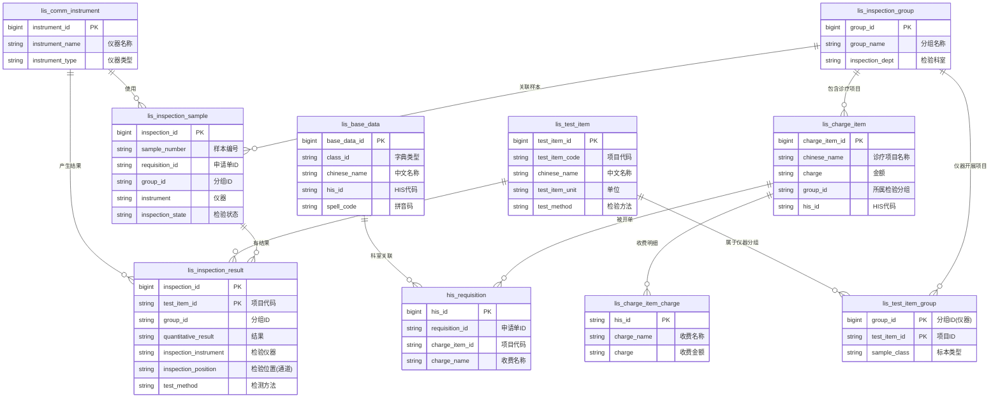

感谢你提供完整的现有表结构。我现在理解了：**你的系统是一个实际的LIS（实验室信息系统）**，已经有一套成熟的表设计。

让我基于现有表结构，重新梳理**数据关系**，并与之前讨论的概念做映射。

---

## 一、现有表结构与概念映射

| 我们讨论的概念 | 现有表 | 说明 |
|--------------|--------|------|
| 科室 | `lis_base_data` (class_id='科室类型') | 基础数据表，通过class_id区分类型 |
| 仪器 | `lis_comm_instrument` | 仪器表 |
| 通道 | **没有独立表** | 通过 `lis_inspection_result.inspection_position` 字段体现 |
| 检验项目 | `lis_test_item` | 检验项目字典 |
| 诊疗项目 | `lis_charge_item` | 诊疗项目对照表 |
| 分组 | `lis_inspection_group` | 检验分组 |
| 收费项目 | `lis_charge_item_charge` | 收费明细 |
| 医嘱申请 | `his_requisition` | HIS申请单 |
| 样本/检验单 | `lis_inspection_sample` | 样本主表 |
| 检验结果 | `lis_inspection_result` | 结果明细表 |

---

## 二、现有核心表关系图（Mermaid）



---

## 三、关键发现：现有系统中“通道”的处理方式

从 `lis_inspection_result` 表结构来看：

```sql
inspection_position VARCHAR(255)  -- 检验位置（即通道）
```

**现有设计中没有独立的通道字典表**，通道是通过 `inspection_position` 字段直接记录的，这与我们之前的结论一致。

---

## 四、现有系统的实体关系总结

```
[his_requisition] 医嘱申请单
       │
       │ charge_item_id
       ↓
[lis_charge_item] 诊疗项目 ←──→ [lis_charge_item_charge] 收费明细
       │
       │ group_id
       ↓
[lis_inspection_group] 检验分组
       │
       ├──→ [lis_test_item_group] 仪器-项目关联
       │            │
       │            ↓
       │      [lis_comm_instrument] 仪器
       │
       └──→ [lis_inspection_sample] 样本主表
                   │
                   │ inspection_id
                   ↓
            [lis_inspection_result] 检验结果
                   │
                   ├── test_item_id → [lis_test_item] 检验项目字典
                   ├── inspection_instrument → 仪器
                   └── inspection_position → 通道号（字符串）
```

---

## 五、与你之前讨论的概念对应关系

| 之前讨论 | 现有实现 |
|----------|----------|
| 通道与检验项目多对多 | 通过 `lis_inspection_result` 的 `(inspection_id, test_item_id)` 组合实现，`inspection_position` 记录通道号 |
| 仪器通道表 | 没有独立表，通道作为检验结果的属性存在 |
| 诊疗项目 vs 检验项目 | `lis_charge_item`（诊疗） → `lis_inspection_group`（分组） → `lis_test_item_group`（仪器项目） → `lis_test_item`（检验项目） |
| 分组 | `lis_inspection_group` + `lis_test_item_group`（仪器项目关联） |

---

## 六、建议补充的关系（如果要做完整数据关系图）

现有表结构缺少以下显式关系，但可以通过字段推导：

1. **仪器与科室的关系**  
   `lis_comm_instrument` 没有直接的科室字段，需要通过 `sys_user.dept_code` 或 `lis_base_data` 间接获取

2. **通道与检验项目的静态配置**  
   现有设计是**运行时记录**（通过结果表），如果需要静态配置表，建议新建 `lis_instrument_channel_item`

3. **诊疗项目与检验项目的直接关联**  
   现有通过“分组”间接关联，如果需要直接关联，可增加 `lis_charge_item_test_item` 中间表

---

需要我基于现有表结构，生成一个**完整的、标注了主外键的数据关系图**吗？或者针对某个具体的业务场景（如“一个仪器的一个通道能做哪些项目”）写出查询SQL？