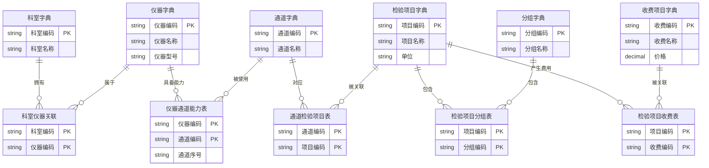

好的，按你的要求调整：

1. **仪器只作为字典**（不直接连通道，通过关联表体现能力）
2. **仪器与科室用关联表**
3. **通道关联检验项目**
4. **Mermaid 画图**

---

## Mermaid 数据关系图代码

---

## 业务路径示例

| 需求 | 查询路径 |
|------|----------|
| 某科室有哪些仪器 | 科室 → 科室仪器关联 → 仪器字典 |
| 某仪器有哪些通道能力 | 仪器 → 仪器通道能力表 → 通道字典 |
| 某通道做什么检验项目 | 通道 → 通道检验项目表 → 检验项目字典 |
| 某检验项目属于哪些分组 | 检验项目 → 检验项目分组表 → 分组字典 |
| 某分组包含哪些检验项目 | 分组 → 检验项目分组表 → 检验项目字典 |
| 某检验项目收费多少 | 检验项目 → 检验项目收费表 → 收费项目字典 |

---

## 关键设计说明

- **仪器字典**：纯基础信息，不直接连业务
- **仪器通道能力表**：体现“这台仪器支持哪些通道”
- **科室仪器关联表**：支持一个仪器归属多个科室（如共享设备）
- **通道检验项目表**：核心映射，一个通道只做一个项目，但一个项目可对应多个通道

如果需要调整图形布局或增加字段，告诉我即可。