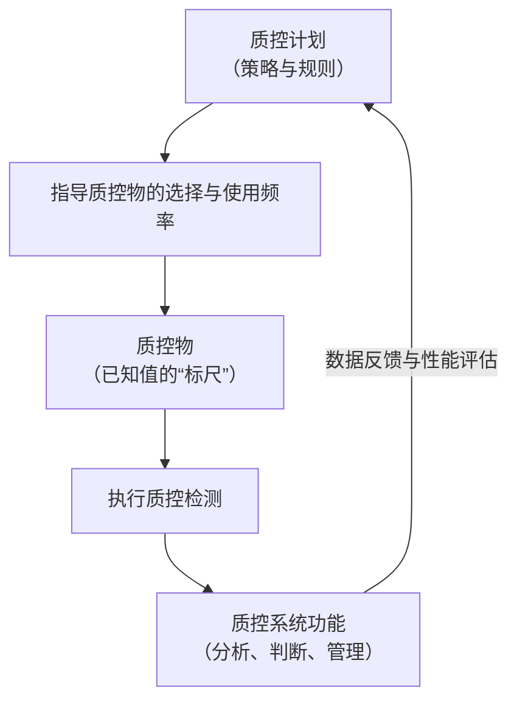

检验系统的质控功能围绕一个核心循环运转：**计划 → 执行 → 判断 → 改进**。而**质控物**是这个体系中不可或缺的“标尺”，用于验证系统状态；**质控计划**则是我们如何以及何时使用这把“标尺”的详细方案。

下面这张图概括了三者之间的核心关系：

### **🛠️ 质控系统的核心功能**

一个完善的质控系统，就像是实验室的“智能管家”，其功能已远超简单的数据记录。它主要承担以下几项关键任务：

*   **参数配置**：为每个检验项目设置质控规则（如常用的**Westgard规则**）、目标均值、标准差（SD）和变异系数（CV）等。
*   **数据采集**：能自动从分析仪器导入质控数据，减少人工录入错误。
*   **智能判断与报警**：实时绘制**Levey-Jennings质控图**，自动判断是否“在控”或“失控”。一旦失控，系统会立即弹出警告，有时还能自动通知相关人员。
*   **失控管理**：强制要求填写失控报告，记录原因分析和纠正措施，形成完整的闭环管理。
*   **报告与追溯**：自动生成质控月总结报告，支持按时间、质控品批号等条件追溯历史数据，随时复盘。

### **🧪 质控物：检验的“标准量尺”**

**质控品**是一种稳定的、其特性值已知的物质，专门用于评价检测系统的性能。

*   **两大类型**：
    *   **定值质控品**：说明书上有具体的靶值和范围，但实验室仍需建立自己的均值。
    *   **非定值质控品**：说明书上不给出具体数值，所有统计参数（均值、SD）都必须由实验室自己测定。

*   **关键区别**：质控品易与**校准品**混淆。简单来说，校准品用于“调准”仪器（建立准确性），而质控品用于“验证”仪器是否仍然准确（评估性能）。

*   **选择与管理**：选择时应优先考虑基质与真实病人样本相似、稳定性好、浓度在临床决定水平附近的质控品。实验室应使用**第三方质控品**以提供更客观的质量评估。

### **📋 质控计划：量身定制的“行动蓝图”**

质控计划是根据每个检验项目的特性，量身定制的具体操作方案，旨在用最小的成本，最有效地检出错误。

制定一个科学的质控计划，需要明确以下几点：

*   **质控频次**：明确规定多久测一次质控品（如每24小时一次，或每个分析批内一次）。
*   **质控品数量与水平**：确定使用几个浓度的质控品（通常是2个或以上水平）。
*   **质控规则**：选用合适的统计规则，如经典的Westgard多规则（如`1₃ₛ`、`2₂ₛ`、`R₄ₛ`等）来判断批次有效性。
*   **性能目标**：质量规范应源于**临床需求**。例如，基于生物学变异设定的“允许总误差”（TEa）是制定规则的依据。

总的来说，这三大要素共同构成了实验室质量保证体系的基石。一个设计良好的质控系统（LIS功能）需要合适的质控物作为基础，并遵循一个深思熟虑的质控计划来执行，从而确保每一份检验报告的准确可靠。